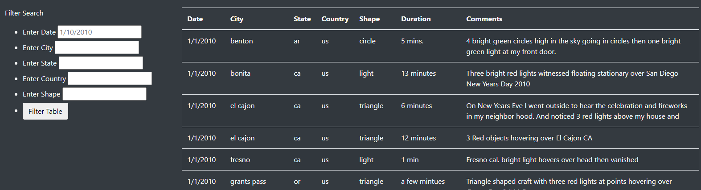
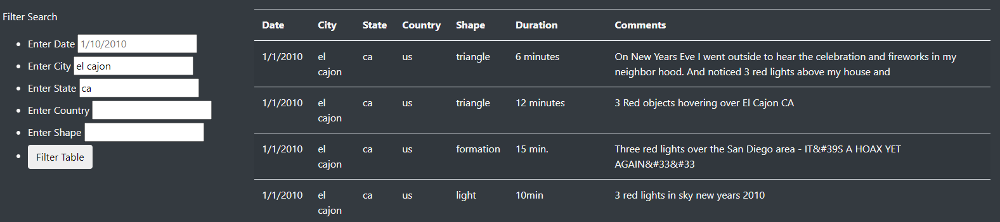

# RBCModule11-Challenge

## Overview of Project

This project is intended to exemplify the creation of a website with a live updating filter (implemnting D3.js) which allows the user to sift through data quickly.
## Results

For those using this website, the filtering process is as easy as typing the search criteria into the corresponding input boxes provided on the left hand sides. See the following images for reference.

UnFiltered:

Filtered:

## Summary

One drawback of our current implementation is that our users must input their search criteria precisely, that is, there is no partial searching or fuzzy searching. For further development we would implement both of those improvements as well as combine the city, state and country fields into a single field. We could also implement a search for the descriptions of the UFO event sightings. 